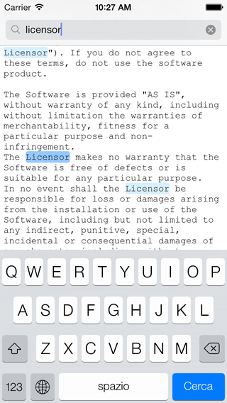

## ICTextView

### Authors

- Ivano Bilenchi ([@SoftHardW](http://www.twitter.com/SoftHardW))

### Description

`ICTextView` is a `UITextView` subclass with optimized support for string/regex search and highlighting.

It also features some iOS 7+ specific improvements and bugfixes to the standard `UITextView`.

### Features

- Support for string literals and regular expression search.
- Match highlighting.
- Highly customizable.
- Doesn't use delegate methods (you can still implement your own).
- Methods to account for `contentInset` and `textContainerInset` in iOS 7+.
- Contains workarounds for many known iOS 7+ `UITextView` bugs.

### Compatibility

**Supported iOS versions:** 4.x and above (match highlighting starting from iOS 5.x).

**Supported iOS SDKs:** 5.x and above.

### Installation

`ICTextView` can be installed via [Cocoapods](http://cocoapods.org) (just add `pod 'ICTextView'` to your Podfile, then run `pod install`) or as a [Git submodule](http://git-scm.com/book/en/Git-Tools-Submodules).

Alternatively, you can clone this repo, or even just grab the [ICTextView](ICTextView) folder and put it somewhere in your project.

`ICTextView` requires the `QuartzCore` framework, so make sure to link against it in your build settings.

It is an ARC only project, meaning you must compile it with ARC enabled (either globally or specifically for every .m source file in the [ICTextView](ICTextView) folder).

`#import "ICTextView.h"` and you're ready to go.

### Configuration

See comments in the `#pragma mark - Configuration` section of the [ICTextView.h](ICTextView/ICTextView.h) header file.

### Usage

##### Search

Searches can be performed via the `scrollToMatch:` and `scrollToString:` methods. `scrollToMatch:` performs regular expression searches, while `scrollToString:` searches for string literals.

Both search methods are regex-powered, and therefore make use of `NSRegularExpressionOptions`. They both support animation, range restriction, custom end scroll positioning and forward/backward search direction.

If a match is found, `ICTextView` highlights a primary match, and starts highlighting other matches while the user scrolls. Searching for the same pattern multiple times automatically matches the next result.

The `rangeOfFoundString` property contains the range of the current search match. You can get the actual string by calling the `foundString` method.

The `resetSearch` method lets you restore the search variables to their starting values, effectively resetting the search. Calls to `resetSearch` cause the highlights to be deallocated, regardless of the `maxHighlightedMatches` property.

After this method has been called, `ICTextView` stops highlighting results until a new search is performed.

##### Content insets methods

The `scrollRangeToVisible:consideringInsets:[...]` and `scrollRectToVisible:animated:consideringInsets:[...]` methods let you scroll until a certain range or rect is visible, eventually accounting for content insets.

This was the default behavior for `scrollRangeToVisible:` before iOS 7, but it has changed since (possibly because of a bug). These methods support animation and scroll positioning, similarly to the search methods.

The other methods are pretty much self-explanatory. See the `#pragma mark - Misc` section of the [ICTextView.h](ICTextView/ICTextView.h) header file for further info.

### iOS 7 UITextView Bugfixes

Long story short, iOS 7 completely broke `UITextView`. `ICTextView` contains fixes for some very common issues:

- **NSTextContainer bug:** `UITextView` initialized via `initWithFrame:` had an erratic behavior due to an uninitialized or wrong `NSTextContainer`.
- **Caret bug:** the caret didn't consider `contentInset` nor `textContainerInset` and often went out of the visible area.
- **characterRangeAtPoint: bug:** `characterRangeAtPoint:` always returned `nil`.
- **becomeFirstResponder bug:** `UITextView` scrolled to a bogus location when becoming first responder in some circumstances.

These fixes, combined with the custom methods to account for `contentInset` and `textContainerInset`, should make working with `ICTextView` much more bearable than working with the standard `UITextView`.

Bugfixes introduced by `ICTextView` will be removed (or isolated) as soon as they are fixed by Apple.

### License

`ICTextView` is available under the MIT license. See the [LICENSE](LICENSE) file for more info.
